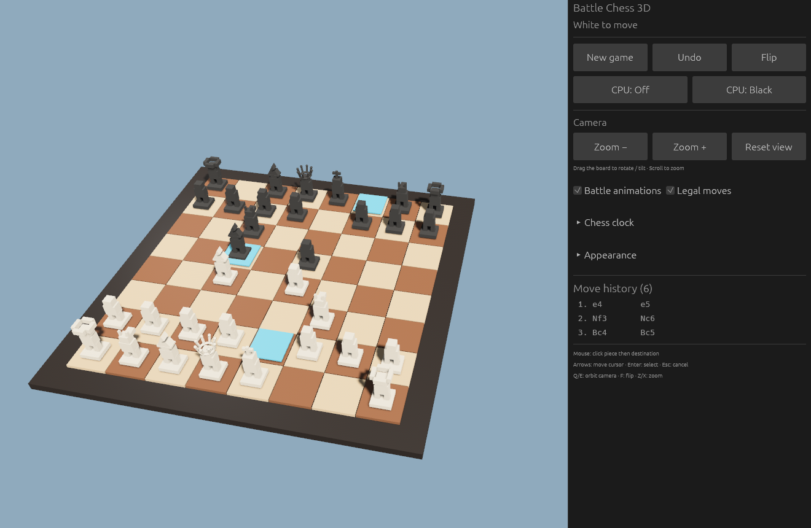

# Battle Chess 3D

A native Rust chess game built with **Bevy** and **egui**, featuring a 3D board,
procedural character pieces, and colorful projectile battles. Play locally with
another person or against the built-in CPU opponent.



## Features

- **Complete chess rules** powered by `shakmaty`: castling, en passant, promotion,
  checkmate, stalemate, insufficient material, the fifty-move rule, and threefold repetition.
- **Distinct 3D pieces**, including a bishop with a slotted mitre, a queen with an
  eight-point crown, and a king with a cross.
- **Piece-specific attacks** with different colors, projectile counts, shapes, and flight paths.
  The capturing piece moves only after every projectile and explosion has finished.
- **Optional CPU opponent** that can play either color, using alpha-beta search.
- **Mouse and keyboard controls**, drag-to-orbit camera, tilt, zoom, and board flip.
- **Responsive sidebar** with larger buttons, zoom controls, and a reset-view button.
- **Chess clocks** with presets and custom time limits; clocks pause during capture effects.
- **Move history and captured-piece display.** Undo reverses the latest move once,
  then becomes available again after another move is played.
- **Custom appearance** with board and piece presets, adjustable colors, gloss,
  knight orientation, and captured-piece poses.

### Battle animations

| Piece | Projectiles | Color and style |
| --- | ---: | --- |
| Pawn | 1 | Orange arcing spark |
| Knight | 2 | Blue crossing lances |
| Bishop | 3 | Violet spiral bolts |
| Rook | 4 | Red cannonballs |
| Queen | 8 | Pink shards in a spreading fan |
| King | 12 | Gold shots in a lofted crown pattern |

Battle animations can be toggled in the sidebar.

## Build and run

Install **Rust 1.95 or newer** with Cargo. The project uses Rust edition 2024.
On Windows, use the MSVC Rust toolchain with the Visual Studio C++ build tools.
On Linux, the native windowing and graphics dependencies for Bevy's X11/Wayland
support must be installed.

```sh
git clone https://github.com/feenix100/battle_chess3d_rust.git
cd battle_chess3d_rust
cargo run --release --locked
```

To build without launching the game:

```sh
cargo build --release --locked
```

The Windows executable is `target/release/battle-chess-3d.exe`.
Meshes are generated in code; no separate model or texture downloads are required.

## Controls

| Input | Action |
| --- | --- |
| Left click | Select a piece, then select its destination |
| Hold left button and drag in the game area | Rotate and tilt the camera |
| Mouse wheel over the game area | Zoom in or out |
| Arrow keys | Move the board cursor |
| Enter / Space | Select the cursor square |
| Escape | Cancel selection |
| Q / E | Orbit the camera |
| F | Flip the board |
| Z / X | Zoom in / out |

The sidebar provides New Game, Undo, Flip, CPU settings, zoom/reset controls,
clocks, appearance settings, and move history.

## Development

```sh
cargo fmt --check
cargo test --locked
```

Run only the relevant tests when working on a specific feature. For example:

```sh
cargo test --locked capture_tests
cargo test --locked undo
```

| File | Purpose |
| --- | --- |
| `src/main.rs` | Bevy scene, procedural pieces, input, UI, clocks, and animation |
| `src/game.rs` | Chess rules, history, captures, draw tracking, and undo |
| `src/cpu.rs` | CPU move search and evaluation |
| `docs/gameplay.png` | Screenshot captured from the running game |

## License

[MIT](LICENSE).
